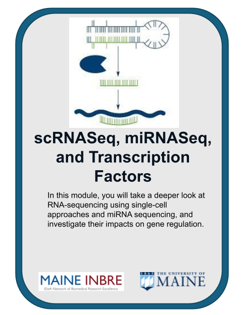
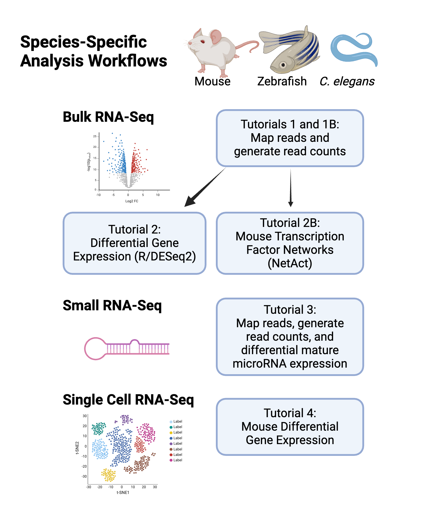

[comment]: <> (Hi. If you are seeing this message, please open this file with markdown preview or jupyter notebook. You can do this by right clicking on the readme file and picking 'open with'.)

# Explore Gene and microRNA Expression Using RNA-seq and Network Analysis

## Overview

Included here are several tutorials in the form of 'Jupyter notebooks'.

The purpose of these tutorials is to help users familiarize themselves with the cloud computing in the specific context of running bioinformatics workflows. Here is a link to a [YouTube video](https://youtube.com) that gives you an overview of the tutorials.

These tutorials do this by going step-by-step through specific workflows for bulk RNA-Seq, small RNA-Seq and single cell RNA-Seq (scRNA-Seq). These workflows cover the start to finish of basic bioinformatics analysis; starting from downloading raw sequence data, and extending to differential gene expression analysis, and producing common plots in R.

## Table of Contents

[Requirements](#requirements)  
[Getting Started](#getting-started)  
[Workflows](#workflows)  
[Data](#data)  
[Support Forum Thanks](#support-forum-thanks)  
[Funding](#funding)  
   

## Requirements

These tutorials were designed to be used on cloud computing platforms, with the aim of requiring nothing but the files within this GitHub repository.

With this in mind, our tutorials use Jupyter Notebook files, which Google Cloud Platform, Amazon Web Service, and Microsoft Azure all provide support for. Therefore, requirements should only require creation of a virtual machine on one of these providers, and the downloading of this github's files to that machine.

For more information on creating a virtual machine and downloading our GitHub repo to that machine, we have a getting started section below. Currently this section only includes information on how to do this using Google Cloud Platform.

## Getting Started

This repository contains several notebook files which serve as bioinformatics workflow tutorials.

The below steps guide you through setting up a virtual machine on Google Cloud Platform, downloading our tutorial files, and running those files. 

Accordingly, before starting, make sure you have a google account and have access to a Google Cloud Platform Project.

Once you have these, you can begin by first navigating to https://console.cloud.google.com/ and logging in with your credentials. Then, in the top left of the screen, navigate to 'select a project', and choose the project you belong to.

This tutorial will cost you just less than $x.xx assuming a n1-standard-8 machine, and assuming you delete the virtual machine and the storage bucket after you finish the tutorial. You can save some time by using an n2 machine, but it will cost a little bit more (thought not that much). 

### Creating a user managed notebook 

Follow the steps highlighted [here](https://github.com/STRIDES/NIHCloudLabGCP/blob/main/docs/vertexai.md) to create a new user-managed notebook in AWS SageMaker. Follow steps 1-8 and be especially careful to enable idle shutdown as highlighted in step 7. For this module you should select Debian 10 and R 4.2 in the Environment tab in step 5. In step 6 in the Machine type tab, select n1-standard-4 from the dropdown box.

To clone this repository, use the Git command `git clone https://github.com/King-Laboratory/scRNASeq-miRNASeq-and-TF-Network-Analysis.git` in the dropdown menu option in Jupyter notebook. Please make sure you only enter the link for the repository that you want to clone. There are other bioinformatics related learning modules available in the [NIGMS Repository](https://github.com/NIGMS). This should download our repo, and the tutorial files inside, into a folder called 'RNA-Seq-Differential-Expression-Analysis'. Double click this folder now. Inside you will find all our tutorial files, which you can double click and run.

### Stopping Your Virtual Machine

When you are finished running code, you can turn off your virtual machine to prevent unneeded billing or resource use by checking your notebook and pushing the **Stop** button.

## Workflows

Our tutorials are broken down into 'workflows'. Each notebook file covers a specific workflow, which contains written and visual commentary, as well as the actual step-by-step code for running that workflow analysis. 

These notebooks were designed to be run using a virtual machine on a cloud computing provider. For more information on how to do this; navigate to the [Getting Started](#getting-started) section. Feel free to explore and run the workflows in any order you like. 

## Species-Specific Workflows

### Mouse

These set of workflows covering data analysis of mouse studies are broken down into four tutorials: bulk RNA-sequencing data (Tutorials 1 and 2), small RNA-sequencing data (Tutorial 3) and Single Cell RNA-sequencing data (Tutorial 4). 

- **Bulk RNA-Sequencing**
  - [Tutorial 1 Mouse Subset Data](Bulk_RNA-Seq_Tutorials/Bulk_RNA-Seq_Mouse/Tutorial_1_alignment_mouse.ipynb): This workflow uses a subset of reads with RSEM to generate read counts, and includes steps for data retrieval, read trimming, quality control, read mapping, and counting mapped reads. Data is stored in an AWS S3 bucket, and processed using Jupyter notebooks on SageMaker.

   - [Tutorial 1b Mouse Full Data](Bulk_RNA-Seq_Tutorials/Bulk_RNA-Seq_Mouse/Tutorial_1_alignment_full_dataset_mouse.ipynb): This workflow uses the full dataset with RSEM to generate read counts, and includes steps for data retrieval, read trimming, quality control, read mapping, and counting mapped reads. Data are downloaded from the Sequencing Read Archive, and processed using Jupyter notebooks on SageMaker.

   - [Tutorial 2 Mouse DEG](Bulk_RNA-Seq_Tutorials/Bulk_RNA-Seq_Mouse/Tutorial_2_DEG_mouse.ipynb): This workflow starts with read count data and uses R/DESeq2 to generate a list of differentially expressed genes. Data are stored in an AWS S3 bucket, and processed using Jupyter notebooks on SageMaker.
     
   - [Tutorial 2b Mouse TF Analysis](Bulk_RNA-Seq_Tutorials/Bulk_RNA-Seq_Mouse/Tutorial_2B_NetAct_mouse.ipynb): This workflow starts with read count data and uses NetAct to perform transcription factor network analysis. Data are stored in an AWS S3 bucket, and processed using Jupyter notebooks on SageMaker.

- **small RNA-Sequencing**
- [Tutorial 3 Mouse](Small_RNA-Seq_Tutorials/Small_RNA-Seq_Mouse/Tutorial_3_miRNA_mouse.ipynb): This workflow starts with read count data, and uses miRGeneDB annotation and R/DESeq2 for read mapping and expression analysis. Data is stored in an AWS S3 bucket, and processed using Jupyter notebooks on SageMaker.

- **Single Cell RNA-Sequencing**
- [Tutorial 4 Mouse](Single_Cell_RNA-Seq_Tutorials/Single_Cell_RNA-Seq_Mouse/Tutorial_4_scRNA-Seq_mouse.ipynb): This workflow starts with read count data, and uses R/seurat for data analysis. Data is stored in an AWS S3 bucket, and processed using Jupyter notebooks on SageMaker.

 

### Zebrafish

##### Zebrafish Bulk RNA-Seq Read Mapping Workflow Using RSEM To Generate Read Counts
- [Bulk_RNA-Seq_Tutorials/Bulk_RNA-Seq_Mouse/Tutorial_1_alignment_zebrafish.ipynb](Bulk_RNA-Seq_Tutorials/Bulk_RNA-Seq_Zebrafish/Tutorial_1_alignment_zebrafish.ipynb) - Zebrafish workflow using a subset of reads.

- [Bulk_RNA-Seq_Tutorials/Bulk_RNA-Seq_Mouse/Tutorial_1B_alignment_full_dataset_zebrafish.ipynb](Bulk_RNA-Seq_Tutorials/Bulk_RNA-Seq_Zebrafish/Tutorial_1_alignment_full_dataset_zebrafish.ipynb) - Zebrafish workflow using the full dataset including downloading reads from SRA.

##### Zebrafish Bulk RNA-Seq Analysis of Read Counts Using R/DESeq2
- [Bulk_RNA-Seq_Tutorials/Bulk_RNA-Seq_Zebrafish/Tutorial_2_DEG_zebrafish.ipynb](Bulk_RNA-Seq_Tutorials/Bulk_RNA-Seq_Mouse/Tutorial_2_DEG_zebrafish.ipynb) - Zebrafish workflow workflow starting with read counts.

##### Zebrafish small RNA-Seq Read Mapping and Expression Analysis Using miRGeneDB Annotation and R/DESeq2
- [Small_RNA-Seq_Tutorials/Small_RNA-Seq_Zebrafish/Tutorial_3_miRNA_zebrafish.ipynb](Small_RNA-Seq_Tutorials/Small_RNA-Seq_Zebrafish/Tutorial_3_miRNA_zebrafish.ipynb) - Zebrafish workflow workflow starting with read counts.

##### Zebrafish Single Cell RNA-Seq Workflow Using R/seurat
- [Single_Cell_RNA-Seq_Tutorials/Single_Cell_RNA-Seq_Zebrafish/Tutorial_4_scRNA-Seq_zebrafish.ipynb](Single_Cell_RNA-Seq_Tutorials/Single_Cell_RNA-Seq_Zebrafish/Tutorial_4_scRNA-Seq_zebrafish.ipynb) - Zebrafish workflow starting with read counts.

#### *C. elegans*

##### *C. elegans* Bulk RNA-Seq Read Mapping Workflow Using RSEM To Generate Read Counts
- [Bulk_RNA-Seq_Tutorials/Bulk_RNA-Seq_C_elegans/Tutorial_1_alignment_c_elegans.ipynb](Bulk_RNA-Seq_Tutorials/Bulk_RNA-Seq_C_elegans/Tutorial_1_alignment_c_elegans.ipynb) - *C. elegans* workflow using a subset of reads.

- [Bulk_RNA-Seq_Tutorials/Bulk_RNA-Seq_C_elegans/Tutorial_1B_alignment_full_dataset_c_elegans.ipynb](Bulk_RNA-Seq_Tutorials/Bulk_RNA-Seq_C_elegans/Tutorial_1_alignment_full_dataset_c_elegans.ipynb) - *C. elegans* workflow using the full dataset including downloading reads from SRA.

##### *C. elegans* Bulk RNA-Seq Analysis of Read Counts Using R/DESeq2
- [Bulk_RNA-Seq_Tutorials/Bulk_RNA-Seq_C_elegans/Tutorial_2_DEG_c_elegans.ipynb](Bulk_RNA-Seq_C_elegans/Tutorial_2_DEG_c_elegans.ipynb) - *C. elegans* workflow workflow starting with read counts.

##### *C. elegans* small RNA-Seq Read Mapping and Expression Analysis Using miRGeneDB Annotation and R/DESeq2
- [Small_RNA-Seq_Tutorials/Small_RNA-Seq_C_elegans/Tutorial_3_miRNA_c_elegans.ipynb](Small_RNA-Seq_Tutorials/Small_RNA-Seq_C_elegans/Tutorial_3_miRNA_c_elegans.ipynb) - *C. elegans* workflow workflow starting with read counts.

## Data

These tutorials use example sequence data procured from the Sequence Read Archive.
- Mouse Bulk RNA-Seq - Study of how proteins from extracellular fluids from muscle (myokines) and fat tissues (adipokines) can signal between tissues. In this study, the authors examined the impact of the candidate adipokine, prosaposin (*Psad*), on gene expression in primary inguinal white adipose (iWAT) adipocytes. The study included primary iWAT transduced with a PSAP-adenovirus or a GFP-adenovirus control.
    - Gene Expression Omnibus: [GSE216094](https://www.ncbi.nlm.nih.gov/geo/query/acc.cgi?acc=GSE216094)
    - Publication: Mittenbühler MJ, Jedrychowski MP, Van Vranken JG, Sprenger HG, Wilensky S, Dumesic PA, Sun Y, Tartaglia A, Bogoslavski D, A M, Xiao H, Blackmore KA, Reddy A, Gygi SP, Chouchani ET, Spiegelman BM. Isolation of extracellular fluids reveals novel secreted bioactive proteins from muscle and fat tissues. *Cell Metab.* 2023;35(3):535-549.e7. [PMID: 36681077](https://pubmed.ncbi.nlm.nih.gov/36681077/). 
- Mouse Small RNA-Seq - Study of skeletal muscle fibrosis by profiling microRNA expression in cultured C2C12 myoblast cells treated with TGFB.
    - Gene Expression Omnibus: [GSE274814](https://www.ncbi.nlm.nih.gov/geo/query/acc.cgi?acc=GSE274814)
- Mouse Single Cell RNA-Seq - Study of gene expression in single ventricular zone cells in the ganglionic eminences of the mouse forebrain.
    - Gene Expression Omnibus: [GSE167013](https://www.ncbi.nlm.nih.gov/geo/query/acc.cgi?acc=GSE167013)
    - Publication: Lee DR, Rhodes C, Mitra A, Zhang Y, Maric D, Dale RK, Petros TJ. Transcriptional heterogeneity of ventricular zone cells in the ganglionic eminences of the mouse forebrain. *Elife.* 2022;11:e71864. [PMID: 35175194](https://pubmed.ncbi.nlm.nih.gov/35175194/); PMCID: PMC8887903.
- Zebrafish Bulk RNA-Seq - Study of chronic exposure to cortisol in zebrafish larvae to study glucocorticoid-induced developmental programming.
    - Gene Expression Omnibus: [GSE80221](https://www.ncbi.nlm.nih.gov/geo/query/acc.cgi?acc=GSE80221)
    - Publication: Hartig EI, Zhu S, King BL, Coffman JA. Cortisol-treated zebrafish embryos develop into pro-inflammatory adults with aberrant immune gene regulation. Biol Open. 2016;5(8):1134-41.[PMID: 27444789](https://pubmed.ncbi.nlm.nih.gov/27444789/); PMCID: PMC5004618.
- Zebrafish Small RNA-Seq - Study of zebrafish cardiac regeneration where the expression of microRNAs at 3 days post ventricular resection are compared to 0 day controls.
    - Gene Expression Omnibus: [GSE106884](https://www.ncbi.nlm.nih.gov/geo/query/acc.cgi?acc=GSE106884) - Just the 6 of the 18 small RNA-Seq samples.
    - Publication: King BL, Rosenstein MC, Smith AM, Dykeman CA, Smith GA, Yin VP. RegenDbase: a comparative database of noncoding RNA regulation of tissue regeneration circuits across multiple taxa. *NPJ Regen Med.* 2018;3:10. [PMID: 29872545](https://pubmed.ncbi.nlm.nih.gov/29872545/); PMCID: PMC5973935.
- *C. elegans* Bulk RNA-Seq - Study of somatic reprogramming during germline development in *C. elegans* *glh-1* mutants and wild-type controls using gene expression (total mRNA transcriptome) and polysome profiling (translatome) from the Updike Lab at MDI Biological Laboratory.
    - Gene Expression Omnibus:  [GSE148737](https://www.ncbi.nlm.nih.gov/geo/query/acc.cgi?acc=GSE148737)
    - Publication: Rochester JD, Min H, Gajjar GA, Sharp CS, Maki NJ, Rollins JA, Keiper BD, Graber JH, Updike DL. GLH-1/Vasa represses neuropeptide expression and drives spermiogenesis in the *C. elegans* germline. *Dev Biol.* 2022;492:200-211. [PMID: 36273621](https://pubmed.ncbi.nlm.nih.gov/36273621/).
- *C. elegans* Small RNA-Seq - Study of the microRNAs regulated by the transmembrane transcription factor MYRF-1. In this study, the authors profiled microRNA expression in MYRF-1 mutants compared to wild-type controls.
    - Gene Expression Omnibus: [GSE262766](https://www.ncbi.nlm.nih.gov/geo/query/acc.cgi?acc=GSE262766)
    - Publication: Xu Z, Wang Z, Wang L, Qi YB. Essential function of transmembrane transcription factor MYRF in promoting transcription of miRNA *lin-4* during *C. elegans* development. *Elife.* 2024;12:RP89903. [PMID: 38963411](https://pubmed.ncbi.nlm.nih.gov/38963411/); PMCID: PMC11223767.

## Support Forum Thanks

Support forum thanks. For almost any programming project, contributions to online databases and support forums are an invaluable resource that are heavily leaned upon. Thank goodness for those people who take the time to answer silly questions.

## Funding

Funded by NIH grant number T32 GM132006 the Maine INBRE Program (NIH/NIGMS P20 GM103423).

## **License for Data**

Text and materials are licensed under a Creative Commons CC-BY-NC-SA license. The license allows you to copy, remix and redistribute any of our publicly available materials, under the condition that you attribute the work (details in the license) and do not make profits from it. More information is available [here](https://tilburgsciencehub.com/about).

This work is licensed under a [Creative Commons Attribution-NonCommercial-ShareAlike 4.0 International License](http://creativecommons.org/licenses/by-nc-sa/4.0/)

